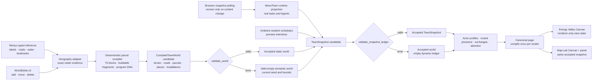

# Energy Valley semantic ecosystem architecture

Status: migration path complete; canonical Rabbita product consumes the
validated semantic world, 2026-08-07

## Decision

Energy Valley is one semantic world, not an accurate Wenyu map with an
unrelated game layer painted over it. The Wenyu source decides **where things
are**; deterministic parcel programs decide **what may happen inside that
geography**; runtime and ambient ledgers decide **what is happening now**; the
renderer decides only **how those facts look**.

`CompiledTownWorld`, `WorldDelta` and `TownSnapshot` live in the
renderer-neutral, pure MoonBit `src/energy_valley_contract` package. The
canonical Rabbita canvas consumes one validated `TownSnapshot`; it no longer
reads the baked raster viewport branch. It must not invent a second terrain,
building, entrance, road route, installation, actor, exchange or evidence
label merely because an animation would be convenient.

## Authority and preservation

| Input or stage | Owns | Preservation rule | Allowed variation |
| --- | --- | --- | --- |
| Wenyu labels, roads, water and landmarks | Geographic evidence | Fixed, or explicitly bounded where the source is approximate | Styling and small visual detail |
| Wenyu road-enclosed topology | The 75 stable top-level legal blocks and land use | All 21,078 enclosure cells retain a block identity; accepted roads, water and wetland are removed to produce 83 disjoint dry regions covering exactly 19,960 cells | Seeded subdivision inside each dry fragment |
| Seeded parcel grammar | Parcel subdivision and program choice | Deterministic for the same blueprint facts and seed | Compatible program, placement anchor, frontage choice and variant seed |
| Player edits | Versioned `WorldDelta` operations | Blueprint-bound, stable-ID, normalized and persisted | Add/move/delete building, road or park |
| Static runtime binding | Stable resource identity only | `runtime_key` survives static compilation | No task, Agent, health or activity observation |
| MoonTown projection | Real work evidence | Dynamic and runtime-gated | Actor profile, route position, portal, slot and status |
| Ambient schedule | Preview town life | Deterministic, bounded and labelled preview | Resident intention, route phase and temporary exchange |
| Attention engine | Derived view state | Ephemeral, with persisted cooldown receipts | Salience, focus and progressive disclosure |

The provenance label travels with every visible activity claim. Only a fresh,
usable runtime projection may claim that an Agent is doing real work.
Connecting, stale, failed and disconnected states keep their truthful status;
ambient residents remain `PREVIEW` even when their movement uses the same
roads and buildings as runtime Agents.

## Stable identity

All contract identities are scoped `StableId` values rather than screen
coordinates. The stability boundary is one blueprint/save lineage: selecting
another blueprint seed intentionally creates another compiled world.

- Wenyu civic buildings, ambient structures, roads, metro stations, portals,
  parcel programs and assignments receive deterministic IDs from their typed
  source identity and compiler facts.
- Player-created buildings receive a collision-free persisted
  `authored-building-v3-<writer>-<dot>` identity from the TownLife event that
  created them. Moving, renaming or resizing one does not change that identity;
  the old numeric sequence remains display/migration metadata only. The
  one-time v2 importer repairs legacy identities before writing V3 authority.
- A custom place uses the authored building identity. Coordinates and style are
  operation payload, never an alternative identity or render-time lookup key.
- The blueprint digest is content-sensitive: sorted road geometry, place
  footprints and parcel-program selections participate, rather than only
  collection counts. The static world cache invalidates on seed and a digest of
  the actual typed operation payload, revision and blueprint lineage. Runtime
  version is intentionally excluded because observations are projected only
  into `TownSnapshot`.

These IDs are the join keys between geography, runtime bindings, selection,
presence, exchanges, attention and inspection. A move is therefore a change
to geometry attached to an identity, not deletion followed by an unrelated
building creation.

## Versioned world edits

Spatial authority now lives inside the same TownLife v3 checkpoint/shard join as
the social journey. Each exact blueprint ID and digest owns a causal epoch plus
immutable typed events. Buildings use browser-writer/dot-derived IDs; road edits
are individual cells rather than replaceable whole components; parks and
buildings use fresh incarnation IDs after deletion. Delete wins for its exact
incarnation, while a higher reset epoch permanently fences every stale event.

`EnergyValleyWorldDeltaLedger` remains only a canonical compiler adapter. It is
derived from the joined world state for each Model and is never independently
written or merged. Road cells are deterministically rebuilt into connected
components, and the event-derived budget starts at the epoch baseline, charges
each accepted add once, and grants at most one half-cost building refund.
Rejected, duplicate, free and spatially invalid transitions have zero economic
effect.

Projection first unions and resolves events, then validates against the cached
immutable base contract using deterministic road reachability, terrain, parcel,
frontage and collision indexes. It does not compile the full 256×144 town on
the synchronous persistence/click path. The renderer performs the single cached
`TownSnapshot` compilation; a rare invalid join uses a deterministic
valid-prefix fallback, retaining unrelated edits while reporting the rejected
transition.
The old `moontown-energy-valley-*` values are read-only migration inputs: one
validated current-state import is installed as an immutable TownLife checkpoint
and only then protected by a permanent global source-consumed fence.

## Local town-life persistence

Avatar state, onboarding, phone history, knowledge posts, analytics, attention
receipts and local operations reports use a separate town-life ledger. The
legacy v1 value and the former mutable v2 checkpoint/shards are migration input
only. They are joined once into an immutable v3 checkpoint; a permanent v3
fence then prevents already-open old frontends from re-entering authority.

Every v3 write creates a new immutable key identified by stable browser-writer
ID and monotonic sequence. The payload is a cumulative join of the current TEA
model and the exact disk manifest read immediately before it. The new shard is
written and byte-for-byte read back synchronously; only successful durability
may schedule later Web Lock compaction of byte-identical captured shards.
Concurrent, changed, corrupt and unobserved keys remain. Released or abandoned
coordination leases are reclaimed after their shards are subsumed. Without a
lock or after a failed write, no deletion occurs, and reset/generate navigation
stays on the page with an explicit save-failure message.

Storage events, BroadcastChannel and a content-hash poll debounce into an
explicit TEA message. Its update joins disk with the current model and never
echo-writes. Quest identities form a set; spark awards are uniquely identified;
bounded histories use per-writer event dots and prune watermarks; player values
use causal last-writer stamps. Knowledge posts use stable sites, incarnation
IDs, reset epochs and tombstones. This is why a background tab can contribute
new activity without rolling a completed 7/7 journey back to an older 1/7
snapshot or resurrecting a deleted social post.

## Parcel and program compiler

The Wenyu adapter reads the typed world model produced from the reference JSON;
it does not trace the rendered image. The authoritative road mask partitions
the 256 × 144 reference into exactly **75 road-enclosed top-level blocks** in
stable row-major anchor order. Their IDs remain stable across layout seeds.

1. Every top-level block retains its stable road-enclosure identity and
   land-use evidence. Together those legal identities account for all
   **21,078 enclosed reference cells**; they must not be misreported as 75 dry
   connected islands.
2. Accepted graph roads plus typed water and wetland split those identities
   into **83 disjoint dry land regions covering exactly 19,960 cells**. Each
   region is represented by deterministic rectangular `BuildableRegion`
   fragments. User-park occupancy is then subtracted before parcel grammar
   runs; no excluded cell can leak into a parcel.
3. A one-cell road-occupied hole remains as an explicit nonparcelable block.
   Keeping its identity is preferable to silently changing the canonical block
   count or fabricating buildable land.
4. Player roads and parks fragment only the affected buildable regions. They
   never renumber the 75 top-level identities.
5. The pure parcel compiler deterministically chooses compatible civic,
   research, residential, mixed-use, park, waterfront, transit or utility
   programs. Each assignment owns its placement anchor, frontage evidence and
   variant seed.

Terrain is compiled independently into deterministic maximal rectangles. The
result covers all **36,864 raster cells exactly once** with typed `TerrainKind`
and provenance; roads are then overlaid from the same authoritative
`RoadNetwork` used by portals, placement and navigation.

A rendered place binds to a parcel only when its **complete footprint** is
inside that parcel. A center-point match is deliberately rejected because it
could place a building across a road or neighboring program. Existing Wenyu
places that do not fit one compiled parcel remain valid unprogrammed places;
the adapter does not fabricate a parcel relationship to make the UI look more
procedural.

For a bound place, the program is semantic DNA. It contributes the building
profile variant, roof treatment, a `Signature` trait, an interaction slot and
the street-level vignette. It never moves or resizes the authored Wenyu
footprint. This is the fusion point between geographic fidelity and playful
procedural detail.

## Roads, portals and access

One typed `RoadNetwork` holds road nodes, segment classes, mobility modes and
directions. Both ambient and runtime navigation use its pedestrian
`shortest_path`; there is no unchecked Manhattan or visual-tile fallback.

Each place that claims the `Accessible` trait has a primary
`EntrancePortal`:

- A direct frontage binds the portal to the exact shared road node.
- An indirect doorway receives a barrier-aware, cardinal pedestrian spur from
  its threshold to a specific reachable road node. The spur becomes real
  `Footpath` nodes and segments in the same graph.
- Gateway connectivity is computed once for the complete typed graph during
  compilation; every doorway then checks membership in that reachable set.
  This avoids both repeated graph walks and a weaker visual-distance guess.
- If a user delta cuts off every valid route, the authored building remains an
  inspectable place but loses its `Accessible` claim and interior interaction
  slots. Its lifecycle is `Away`/unreachable. The compiler does not delete the
  building, invent a nearest-road teleport, claim indoor occupancy, or reject
  the otherwise valid town.

Access anchors are intentionally sparse and deterministic. With the production
typed road snapshot, the compiler selects at most one typed road that actually
touches each literal crop edge, preferring the candidate nearest that edge's
center. Accessible metro entrance frontages add explicit transit gateways. An
interior dead end is never an access anchor: treating it as external evidence
would hide a disconnected component.

Static/test startup may run before the typed road snapshot is available. Only
in that generated-network fallback does the same four-way selection use the
generated road extent (`min/max x/y`) instead of the literal crop boundary.
This fallback does not reinterpret interior dead ends and is replaced once the
typed Wenyu snapshot is ready. Marking every road node as an anchor would make
reachability validation meaningless, so neither path does that.

World validation checks that every place claiming `Accessible` has exactly one
primary portal bound to a real road node that can reach an anchor in at least
one declared mobility mode. Sealed authored buildings are valid only when they
make no accessibility claim. Validation also checks parcel
membership, program compatibility, interaction-slot definitions, stable
runtime bindings and provenance. Presence, slot occupancy and exchange
references belong to the separate dynamic-ledger validator described below.

## Semantic public realm

Metro Line 17 alignments, stations and exits, waterfront boardwalks, trees,
lights, benches and planters are `Installation` values inside
`CompiledTownWorld`. Each carries a stable identity, typed point/path/area
geometry, provenance, optional owner/attention target and an interaction flag.
Canvas and Map Lab consume those records; neither maintains a private list of
decorations. This makes a bench a discoverable place for attention and social
behavior, and makes transit/boardwalk geometry inspectable evidence rather
than paint baked into a background.

## Polling, caching and failure containment

The browser polls runtime text snapshots every five seconds with `no-store`
fetches and a bounded timeout. Polling is content-sensitive: JavaScript updates
the corresponding version global only when the fetched (or transformed) text
actually differs from the value already installed. An unchanged response does
not invalidate the MoonBit projection or restart movement. A transition to a
fallback/error payload bumps once; repeated identical failures remain stable.

Static world caching and production validity are separate concerns. On each
new semantic cache key, the adoption layer compiles a candidate and runs
`validate_world` before accepting it. If any error is present, compilation
fails closed to a **valid empty semantic world** with the current seed and
bounds, and records the failure for diagnostics. The base Wenyu image remains
visible, but semantic roads, places, programs, attention targets and
interactions are disabled until the current candidate validates.

The compiler never retains a previous or different blueprint as fallback.
Doing so would mix old semantic routes and portals with the compatibility
renderer's current geometry. It also never publishes the rejected candidate.
The only fallback is an empty contract world valid for the current geometry
envelope.

The compatibility snapshot is correspondingly static: a place carries only a
stable `runtime_key` resource binding. Tasks, Agents, health, live activity and
freshness never enter the static world or its cache key. All such observations
become dynamic `TownSnapshot` ledger entries, so a static cache hit cannot
retain a stale `Live` claim.

## Shared activity lifecycle

`TownSnapshot` is the time-indexed ledger over the compiled world. It contains
attention signals and focuses, `ActorProfile`, `ActorPresence` and
`PlaceExchange` records. A profile carries stable display/role/avatar/palette
and truth-source facts. A presence names the actor, place, optional portal,
optional interaction slot, optional validated `ActorRoutePosition`, phase,
activity, intention, lifetime and provenance. An exchange names its source and
destination places, optional actor, kind, intensity, lifetime and provenance.

The contract supports `Approaching`, `AtEntrance`, `Inside`, `Departing` and
`Away`. The current ambient and runtime projections use the following common
rules:

1. Resolve semantic source and destination places.
2. Resolve each place's primary portal and a pedestrian route on the typed
   graph.
3. Project travel as `Approaching`, the final segment as `AtEntrance`, arrival
   as `Inside`, and missing route evidence as `Away`. Outdoor actors carry a
   route position validated against the same network and portals.
4. Allocate a compatible interaction slot only while inside. Allocation is
   capacity-aware across ambient and runtime actors: it first selects a
   compatible slot with room, then another available slot, and returns no slot
   if the place is full. It never knowingly overbooks a slot. The outdoor
   sprite disappears, so one actor cannot be both on the street and in a room.
5. Project ambient residents, runtime Agents and the local player through the
   same profile/presence contract. Canvas and pointer hit testing consume the
   same snapshot actor record, so selection cannot drift from the drawn sprite.
6. Keep lifecycle and motion stable across renders and unrelated polling
   changes. A runtime clock stores both `started_at_tick` and `started_at_ms`
   per journey key: Agent, work item, origin and destination. The matching
   clock preserves both domains across refreshes; a changed journey receives
   the current town tick and browser wall-clock. Semantic `since_tick` reads
   the former and route animation reads elapsed time from the latter, instead
   of reusing task timestamps or restarting every Agent together.

Ambient schedule transitions currently emit typed place-to-place exchanges.
Live runtime work contributes evidence-backed presences through the same
snapshot and follows the same semantic route/lifecycle. Runtime-authored
exchange receipts are not yet available upstream, so the adapter does not
invent them from task animation.

Runtime snapshots are append-only transport evidence and can repeat an
unchanged Agent/task record. Before validation, the adapter normalizes signals,
focuses, presences and exchanges by their stable semantic identity. Repetition
therefore cannot create two occupants or invalidate an otherwise sound frame;
conflicting identities still reach validation and fail closed.

Every production candidate ledger passes `validate_snapshot_ledger`. It
rejects duplicate active presence for one actor, missing places/portals/slots,
over-capacity inside slots, invalid lifetimes, dangling exchange endpoints and
invalid provenance or intensity. Any error fails closed to the already
accepted world plus empty signals, focuses, presences and exchanges for that
frame. Static geography remains available, but no unvalidated dynamic truth is
shown.

## TownSnapshot-authoritative presentation

For every dynamic semantic claim, the validated `TownSnapshot` is the sole
authority. The static compatibility world provides only stable place/resource
bindings and cannot claim current work, presence or activity:

- Active exchange curves and packets are derived only from
  `TownSnapshot.active_exchanges()`. Their endpoints resolve to semantic place
  slots or portals; missing endpoints are omitted, never reconstructed from
  legacy arrays.
- Program-driven building vignettes read the place's compiled `program_id`.
- The status digest reports active semantic signals, presences and exchanges.
- Building occupancy, arrival badges, activity labels and inspector "此刻在这里"
  content are projected exclusively from `TownSnapshot.presences_at(place)`.
  Only `Inside` counts as occupancy; `Approaching` and `AtEntrance` are shown
  as arrivals, and `Departing` remains a separate state. There is no assigned
  building or resident-schedule fallback for an occupancy claim.
- The inspector exposes provenance, runtime freshness, access evidence,
  program DNA, relationships and the residents currently associated with the
  place. Door and affordance state is reconciled against the accepted contract
  place, so a visually adjacent but gateway-disconnected frontage cannot still
  advertise "可通行" or indoor work actions.
- The page compiles one accepted snapshot per render and passes that exact
  value to the Energy Valley Canvas, Map Lab Canvas and Map Lab panel. Both
  canvases accept only `TownSnapshot` plus renderer-only view state; neither
  receives `Model`, calls a compiler, reads `ExactEnergyValleyWorld`, or queries
  saved coordinate arrays.
- Runtime Agent rendering and pointer hit testing consume the same
  `TownSnapshotCanvasActor` record, preventing two interpretations of
  visibility, route position or the 24-agent drawing cap.

The UI makes the evidence boundary visible: `REAL · 运行时证据` means a usable
live runtime projection; `PREVIEW · 环境日程` means deterministic ambient life.
A stale runtime snapshot is shown as historical evidence and never relabelled
as current execution.

## Attention and progressive disclosure

Attention is a camera and interaction concern, not another permanent map
layer:

- **Glance:** motion, light, glyph or a short beacon on the map.
- **Nearby:** a concise name and intention when the camera is close.
- **Inspect:** personality, arrival/access evidence, affordances, program DNA,
  dependencies and runtime truth in the existing inspector.
- **Act:** opening a signal records a cooldown receipt and navigates to its
  semantic target.

The expanded town-status surface ranks at most three signals. Runtime truth is
weighted ahead of ordinary ambient life, and viewed routine signals cool down.
The map remains the primary surface instead of becoming an operations wall.

## Implemented invariants

1. The Wenyu compiler emits exactly 75 stable road-enclosed legal block IDs,
   accounts for all 21,078 enclosure cells, and derives 83 disjoint accepted
   dry regions covering exactly 19,960 cells.
2. Terrain covers all 36,864 map cells exactly once; graph-road, water and
   wetland exclusion and dry-region conservation are independently testable.
3. Geography and procedural variation meet through buildable fragments,
   parcels and program IDs; the procedure cannot redraw the Wenyu boundary.
4. Every place, portal, road node, slot, installation, actor and attention
   target has a scoped semantic identity.
5. Player edits persist as blueprint-bound typed `WorldDelta` operations.
6. A place receives a parcel program only under full-footprint containment.
7. One typed road graph powers rendering, placement, entrances and navigation.
8. Accessible places have exactly one gateway-reachable primary entrance;
   sealed places cannot silently cross obstacles.
9. Civic, ambient and player buildings compile through the same `Place` plus
   `BuildingProfile`/site contract.
10. Runtime, ambient and player actors share profiles, routed presences, portals
    and capacity-aware slots while retaining distinct truth provenance.
11. A street sprite and an inside presence cannot represent the same actor at
    the same time.
12. The page compiles one snapshot and both canvases consume that same value;
    pointer hit testing uses the exact accepted frame and actor projection.
13. Active exchange rendering reads the snapshot ledger, not decorative
    relationship guesses.
14. Place occupancy and inspector presence read the same snapshot; only
    `Inside` counts as occupancy.
15. Metro, boardwalk, trees, lights, benches and planters are semantic
    installations, not renderer-owned decoration arrays.
16. Static candidates are validated before publication; failure yields a valid
    empty world for the current seed and bounds, never stale geometry.
17. Dynamic ledgers validate independently; failure preserves the accepted
    world but clears untrusted dynamic claims.
18. Static caches contain geography/program facts and stable runtime bindings,
    never live runtime observations.
19. Access anchors are boundary/metro gateways, never arbitrary interior dead
    ends.
20. The canonical production route has no selectable legacy viewport branch,
    and the former public `TownSceneLayout`/baked scene-render API is physically
    retired repo-wide. Operations remains a non-spatial, explicit surface.

## Map Lab and migration completion

Map Lab (`Shift+M`) is the acceptance surface for this architecture. It can
toggle reference evidence, compiled terrain, blocks, parcels, roads,
navigation, portals, places, semantic installations, provenance, validation
issues and rejected placements. Stable-ID search links the textual evidence to
its map anchor. The panel and its canvas receive the canonical page's exact
`TownSnapshot` plus renderer-only `MapLabViewState`; neither surface receives
the application `Model` or performs world derivation. The entity browser
streams at most 40 lightweight search rows from the snapshot and materializes
full facts only for the selected StableId, so the 15,000-plus semantic public
realm objects do not block first open. Opening Map Lab cannot mutate the town.

The original ingestion code remains as a bounded **compiler adapter**: it reads
typed Wenyu JSON and produces the contract. It is not a second production map
or rendering branch. The old standalone/baked-raster viewport route and its
dead shell are retired, as are the core `TownSceneLayout`, scene-render model
and baked background emitter. `index.html` and `viewport.html` both resolve to
the canonical semantic product, while Operations remains an explicit,
non-spatial separate surface.

Future upstream improvements—such as runtime-authored exchange receipts or
native semantic origin IDs—can remove adaptation work, but they do not change
the map authority or leave any item in this migration path incomplete.
